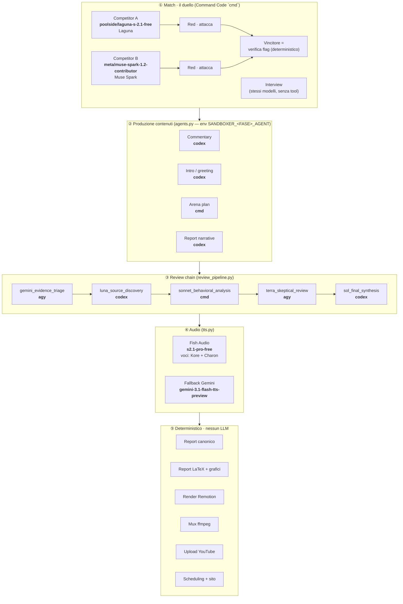

# Modelli per fase — mappa esatta

Come i modelli LLM sono usati in ogni fase della pipeline, con gli **ID esatti**.
Aggiorna questo file quando cambia un default in `sandboxer_v0/agents.py`,
`sandboxer_v0/review_pipeline.py`, `sandboxer_v0/tts.py` o `pilot/config.json`.

## Tabella riassuntiva

| Fase | Modulo | Agente/Modello | ID esatto | Fallback deterministico |
|---|---|---|---|---|
| **Match — Blue/Red/Interview** | `command_code.py` | `cmd` (Command Code) | `poolside/laguna-s-2.1-free` · `meta/muse-spark-1.2-contributor` | — (esito sempre da verifica flag) |
| **Commentary** (telecronaca) | `commentary.py` | `codex` (OpenAI Codex) | **`gpt-5.6-luna`** (Luna 5.6) | `draft_commentary` fallisce chiuso |
| **Intro / greeting** | `commentary.py` | `agy` (Antigravity Gemini) | **`gemini-3.7-flash-high`** (Gemini 3.7) | rundown deterministico del caller |
| **Arena plan** (coreografia) | `arena_visual.py` | `cmd` (Command Code) | **`meta/muse-spark-1.2-contributor`** (Muse Spark Contributor) | `FakeArenaVisualDrafter` |
| **Report narrative** | `report_narrative.py` | `agy` (Antigravity Gemini) | **`gemini-3.7-flash-high`** (Gemini 3.7) | `DeterministicReportNarrativeDrafter` |
| **Review — evidence triage** | `review_pipeline.py` | `agy` (Antigravity Gemini) | `gemini-3.7-flash-high` | — |
| **Review — source discovery** | `review_pipeline.py` | `codex` | **`gpt-5.6-luna`** | — |
| **Review — behavioral analysis** | `review_pipeline.py` | `cmd` | **`meta/muse-spark-1.2-contributor`** | — |
| **Review — skeptical review** | `review_pipeline.py` | `agy` | `gemini-3.7-flash-high` | — |
| **Review — final synthesis** | `review_pipeline.py` | `codex` | **`gpt-5.6-luna`** | — |
| **TTS (voce)** | `tts.py` | Fish Audio | `s2.1-pro-free` · voci Kore/Charon (`reference_id`) | Gemini fallback |
| **Report canonico** | `report.py` | — nessun LLM | deterministico dal bundle | — |
| **Report LaTeX + grafici** | `report_latex.py` | — nessun LLM | deterministico (matplotlib) | — |
| **Render / mux / upload / sito** | `video.py`, `youtube.py`, `schedule.py` | — nessun LLM | deterministico | — |

## Note

- **Override per fase:** `SANDBOXER_<FASE>_AGENT=codex|cmd|agy` (es. `SANDBOXER_COMMENTARY_AGENT=cmd`) e `SANDBOXER_<FASE>_MODEL=<id>` per il modello. Default in `PHASE_DEFAULTS` (`agents.py`): commentary=`codex`, arena=`cmd`, report_narrative=`agy`, intro=`agy`.
- **Modelli default degli agenti** (`agents.py`): `codex` → **`gpt-5.6-luna`** (Luna 5.6), `cmd` → **`meta/muse-spark-1.2-contributor`** (Muse Spark Contributor), `agy` → **`gemini-3.7-flash-high`** (Gemini 3.7).
- **`agy` è geo-bloccato** su questo host (Antigravity `FAILED_PRECONDITION: User location is not supported`): le fasi che lo preferirebbero ricadono su `cmd`/`codex` o sul drafter deterministico. L'adapter è comunque implementato e funzionerà in una regione supportata.
- **Report**: i *fatti* (vincitore, esiti, budget, hash) sono sempre derivati meccanicamente dal bundle firmato; i modelli scrivono solo la *prosa* (narrative, commentary, intro), validata fail-closed e con fallback deterministico.
